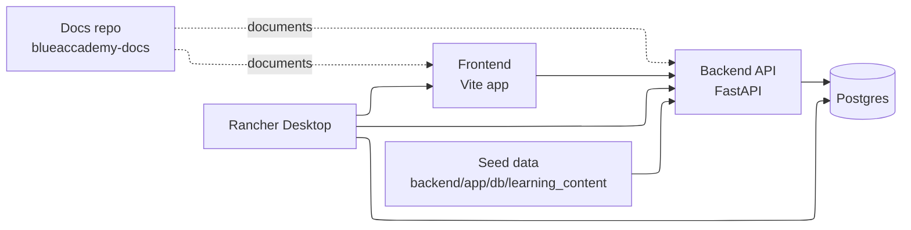

BlueAccademy currently runs as a split frontend and backend application with Docker Compose used as the main local entrypoint.

## System view

## Core components

- `frontend/` serves the browser application
- `backend/app/` contains the FastAPI server, schemas, services, and routing
- `backend/app/db/learning_content/` stores repo-managed starter content
- `infra/` contains the Dockerfiles and Compose runtime files
- `blueaccademy-docs` documents the application and contributor workflow, but does not run the app itself

## Main repo layout

The main product repository is `blueaccademy`.

Important directories:

- `frontend/` for the frontend application
- `backend/app/` for the FastAPI backend
- `backend/app/services/flashcards/` for the current stable flashcard logic
- `backend/app/db/learning_content/` for repo-managed starter content
- `infra/` for Dockerfiles and the local Compose setup

## Current runtime

The runtime defined in `infra/docker-compose.yml` starts:

| Service | Port | Role |
|---|---|---|
| `postgres-db` | `5432` | Persists decks, cards, settings, and progress |
| `backend-api` | `8000` | Runs FastAPI and the current supported backend slice |
| `frontend` | `5173` | Serves the browser UI |

The backend health check targets `http://localhost:8000/api/v1/health`.

## Seeding model

Starter content is kept in the repository and loaded into the database at startup.

Files you will care about most:

- `backend/app/db/learning_content/decks.json`
- `backend/app/db/learning_content/cards.json`

Additional learning-content files exist for in-progress areas such as terminal exercises and CKAD-style flows. Their presence does not change the current support boundary.

## Routing reality

The FastAPI application includes a wider set of routers in code, but `backend/app/main.py` only mounts the broader routes when `settings.enable_more` is enabled.

That is an important architectural clue:

- Flashcards and health routes are part of the current default runtime.
- Broader product surfaces are conditional or in-progress.
